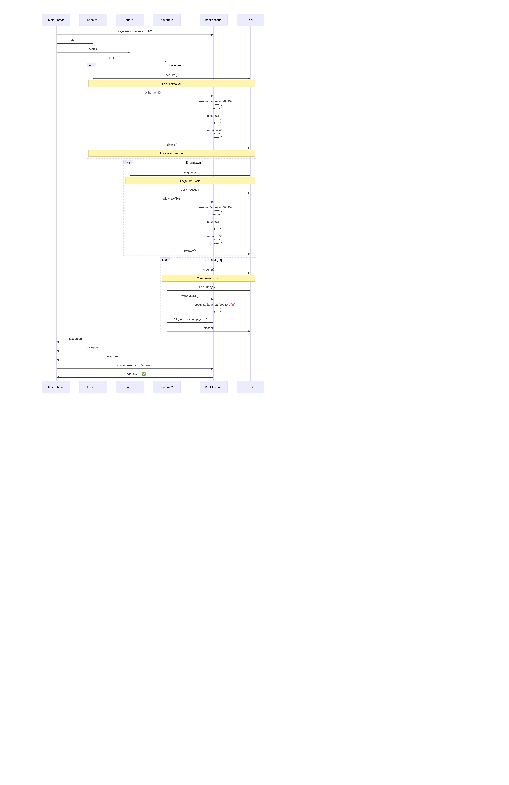
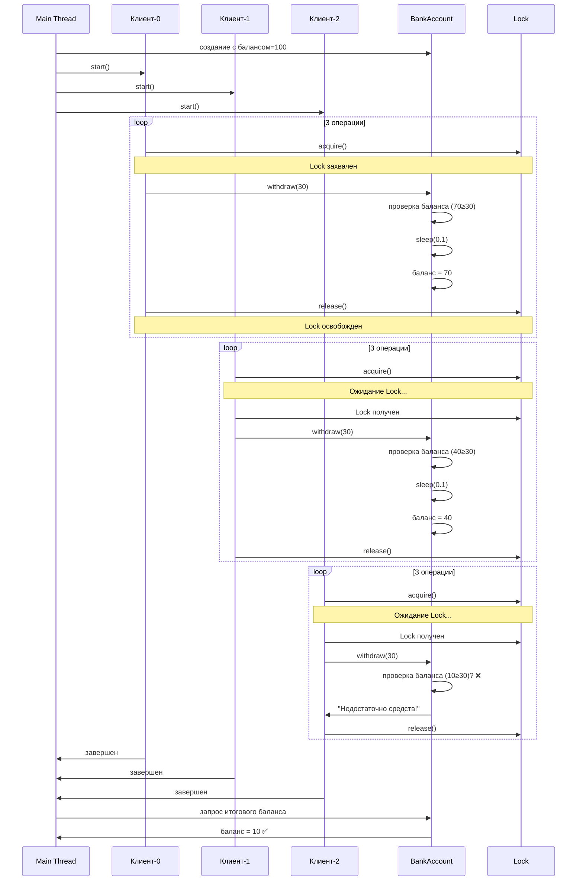
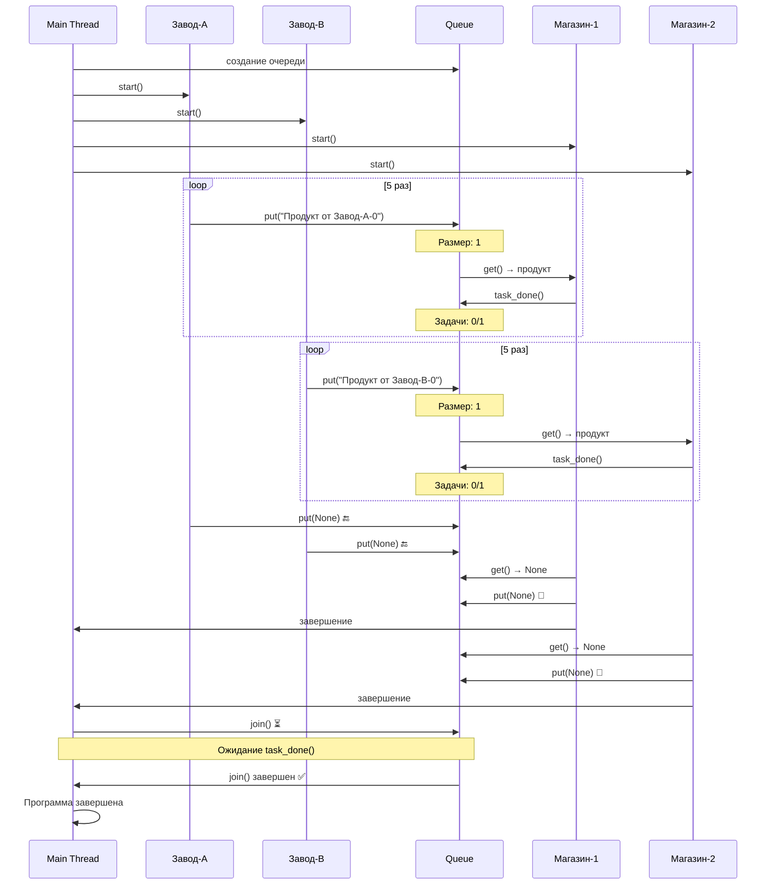
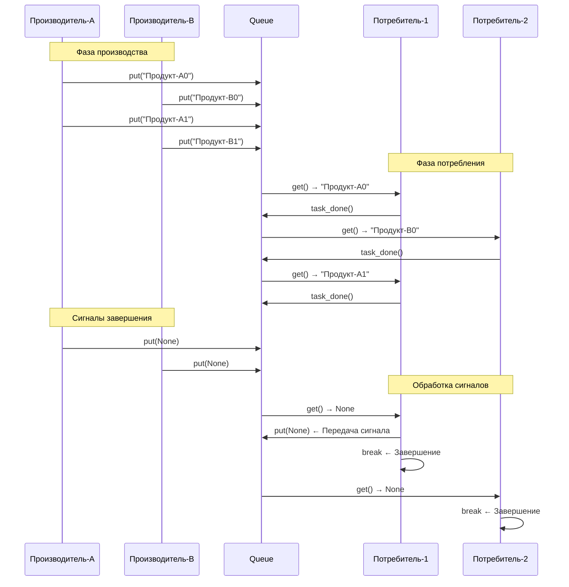

## 🎯 1. БАЗОВЫЕ ЗАДАНИЯ

### **Пример 1: Самый простой поток**
```python
import threading
import time

def print_numbers():
    """Функция, которая будет выполняться в потоке"""
    for i in range(5):
        print(f"Поток: число {i}")
        time.sleep(1)

def print_letters():
    """Другая функция"""
    for letter in 'ABCDE':
        print(f"Поток: буква {letter}")
        time.sleep(1)

# Создаем потоки
thread1 = threading.Thread(target=print_numbers)
thread2 = threading.Thread(target=print_letters)

# Запускаем потоки
thread1.start()
thread2.start()

# Ждем завершения потоков
thread1.join()
thread2.join()

print("Все потоки завершили работу!")
```

**Что происходит:** Два потока работают параллельно, выводя числа и буквы одновременно.

---

### **Пример 2: Поток с аргументами**
```python
import threading

def worker(name, delay, count):
    """Поток с параметрами"""
    for i in range(count):
        print(f"{name}: шаг {i+1}")
        time.sleep(delay)

# Создаем несколько потоков с разными параметрами
threads = []
for i in range(3):
    t = threading.Thread(
        target=worker,
        args=(f"Поток-{i}", 0.5, 4)  # (имя, задержка, количество)
    )
    threads.append(t)
    t.start()

# Ждем все потоки
for t in threads:
    t.join()

print("Работа завершена!")
```

---

## 🔐 2. СИНХРОНИЗАЦИЯ И БЛОКИРОВКИ


### **Пример 3: Проблема без синхронизации (Race Condition)**
```python
import threading

class BankAccount:
    def __init__(self):
        self.balance = 100  # Начальный баланс
    
    def withdraw(self, amount):
        # ПРОБЛЕМА: если два потока читают баланс одновременно
        if self.balance >= amount:
            time.sleep(0.1)  # Имитация задержки
            self.balance -= amount
            print(f"Снятие {amount}. Остаток: {self.balance}")
        else:
            print("Недостаточно средств!")

# Тестируем без синхронизации
account = BankAccount()

def customer_operations():
    for _ in range(3):
        account.withdraw(30)

# Запускаем несколько "клиентов" одновременно
threads = []
for i in range(3):
    t = threading.Thread(target=customer_operations, name=f"Клиент-{i}")
    threads.append(t)
    t.start()

for t in threads:
    t.join()

print(f"Итоговый баланс: {account.balance}")  # Будет неправильный результат!
```

### **Пример 4: Решение с Lock**
```python
import threading

class SafeBankAccount:
    def __init__(self):
        self.balance = 100
        self.lock = threading.Lock()  # Создаем блокировку
    
    def withdraw(self, amount):
        with self.lock:  # Автоматически захватывает и освобождает блокировку
            if self.balance >= amount:
                time.sleep(0.1)
                self.balance -= amount
                print(f"Снятие {amount}. Остаток: {self.balance}")
            else:
                print("Недостаточно средств!")

# Тестируем с синхронизацией
safe_account = SafeBankAccount()

def safe_customer_operations():
    for _ in range(3):
        safe_account.withdraw(30)

threads = []
for i in range(3):
    t = threading.Thread(target=safe_customer_operations, name=f"Клиент-{i}")
    threads.append(t)
    t.start()

for t in threads:
    t.join()

print(f"Итоговый баланс: {safe_account.balance}")  # Теперь правильный!
```
Отличное решение с использованием блокировок! Давайте разберем его пошагово с подробными объяснениями.

## Пошаговое объяснение кода

### Шаг 1: Импорт и создание класса
```python
import threading

class SafeBankAccount:
    def __init__(self):
        self.balance = 100  # Начальный баланс
        self.lock = threading.Lock()  # Создаем блокировку
```
- **`threading.Lock()`** создает объект блокировки
- Блокировка обеспечивает взаимное исключение (mutex) - только один поток может выполнять защищенный код одновременно

### Шаг 2: Безопасный метод withdraw
```python
def withdraw(self, amount):
    with self.lock:  # Автоматически захватывает и освобождает блокировку
        if self.balance >= amount:
            time.sleep(0.1)  # Имитация задержки операции
            self.balance -= amount
            print(f"Снятие {amount}. Остаток: {self.balance}")
        else:
            print("Недостаточно средств!")
```
- **`with self.lock:`** - контекстный менеджер, который:
  - **Захватывает блокировку** при входе в блок
  - **Автоматически освобождает** при выходе (даже при исключениях)
- Критическая секция защищена от одновременного доступа

### Шаг 3: Создание потоков
```python
safe_account = SafeBankAccount()

def safe_customer_operations():
    for _ in range(3):
        safe_account.withdraw(30)

threads = []
for i in range(3):
    t = threading.Thread(target=safe_customer_operations, name=f"Клиент-{i}")
    threads.append(t)
    t.start()
```
- Создается 3 потока, каждый выполняет 3 операции снятия по 30 единиц
- Без блокировки это привело бы к состоянию гонки

### Шаг 4: Ожидание завершения и результат
```python
for t in threads:
    t.join()

print(f"Итоговый баланс: {safe_account.balance}")  # Теперь правильный!
```
- **`join()`** ожидает завершения всех потоков
- Результат будет корректным благодаря синхронизации

## Диаграмма последовательностей в Mermaid




## Что происходит в коде:

1. **Поток 1** захватывает блокировку и выполняет все 3 операции снятия
2. **Поток 2** пытается захватить блокировку, но ждет пока Поток 1 ее освободит
3. **Поток 3** также ожидает своей очереди
4. Каждый поток последовательно получает доступ к критической секции
5. Последняя операция отклоняется из-за недостатка средств

**Результат:** Итоговый баланс = 10 (вместо некорректного отрицательного значения без синхронизации)

---

## 📊 3. ОЧЕРЕДИ ДЛЯ ОБМЕНА ДАННЫМИ

### **Пример 5: Производитель-Потребитель с Queue**
```python
import threading
import queue
import time
import random

def producer(q, name):
    """Производит данные и кладет в очередь"""
    for i in range(5):
        item = f"Продукт от {name}-{i}"
        q.put(item)
        print(f"🛠️  {name} произвел: {item}")
        time.sleep(random.uniform(0.1, 0.5))
    q.put(None)  # Сигнал завершения

def consumer(q, name):
    """Потребляет данные из очереди"""
    while True:
        item = q.get()
        if item is None:
            q.put(None)  # Передаем сигнал дальше
            break
        print(f"🛒 {name} купил: {item}")
        time.sleep(random.uniform(0.2, 0.7))
        q.task_done()

# Создаем очередь
q = queue.Queue()

# Создаем потоки
producers = [
    threading.Thread(target=producer, args=(q, "Завод-A")),
    threading.Thread(target=producer, args=(q, "Завод-B"))
]

consumers = [
    threading.Thread(target=consumer, args=(q, "Магазин-1")),
    threading.Thread(target=consumer, args=(q, "Магазин-2"))
]

# Запускаем всех
for p in producers:
    p.start()

for c in consumers:
    c.start()

# Ждем завершения производителей
for p in producers:
    p.join()

# Ждем завершения потребителей
q.join()  # Ждем обработки всех элементов

print("🎉 Все товары произведены и проданы!")
```


## Пошаговое объяснение кода

### Шаг 1: Импорт и настройка
```python
import threading
import queue
import time
import random
```
- **`queue.Queue()`** - потокобезопасная очередь, которая сама handles синхронизацию
- Не нужно явно использовать Lock - очередь уже потокобезопасна

### Шаг 2: Функция producer (производитель)
```python
def producer(q, name):
    for i in range(5):
        item = f"Продукт от {name}-{i}"
        q.put(item)  # Безопасное добавление в очередь
        print(f"🛠️  {name} произвел: {item}")
        time.sleep(random.uniform(0.1, 0.5))
    q.put(None)  # Сигнал завершения
```
- **`q.put(item)`** - атомарная операция добавления
- **`q.put(None)`** - специальный сигнал "конец данных"

### Шаг 3: Функция consumer (потребитель)
```python
def consumer(q, name):
    while True:
        item = q.get()  # Блокируется если очередь пуста
        if item is None:
            q.put(None)  # Передаем сигнал дальше
            break
        print(f"🛒 {name} купил: {item}")
        time.sleep(random.uniform(0.2, 0.7))
        q.task_done()  # Подтверждаем обработку
```
- **`q.get()`** - блокируется и ждет, если очередь пуста
- **`q.task_done()`** - уменьшает счетчик задач для `q.join()`

### Шаг 4: Запуск и синхронизация
```python
q = queue.Queue()

# Создаем и запускаем потоки
for p in producers: p.start()
for c in consumers: c.start()

# Синхронизация
for p in producers: p.join()  # Ждем завершения производителей
q.join()  # Ждем обработки всех элементов в очереди
```
- **`q.join()`** - блокируется пока `q.task_done()` не будет вызван для всех элементов

## Диаграмма последовательностей в Mermaid



## Альтернативная диаграмма с более детальным взаимодействием:



## Ключевые механизмы синхронизации:

1. **Автоматическая блокировка** - Queue внутренне использует Lock
2. **Условные переменные** - `get()` блокируется при пустой очереди
3. **Счетчик задач** - `task_done()` и `join()` для отслеживания завершения
4. **Сигналы завершения** - None как маркер окончания данных

## Что происходит в программе:

1. **2 производителя** создают по 5 продуктов каждый
2. **2 потребителя** параллельно забирают продукты из очереди
3. Когда производители заканчивают, они отправляют сигнал None
4. Потребители получают сигнал и корректно завершаются
5. `q.join()` гарантирует, что все продукты обработаны перед завершением

**Результат:** Потокобезопасное взаимодействие без явного использования Lock!
---

## ⚡ 4. ПРАКТИЧЕСКИЕ ПРИМЕРЫ

### **Пример 6: Параллельная загрузка файлов**
```python
import threading
import time
import random

def download_file(filename, size):
    """Имитация загрузки файла"""
    print(f"📥 Начата загрузка: {filename}")
    
    # Имитируем разное время загрузки
    download_time = random.uniform(1, 3)
    time.sleep(download_time)
    
    print(f"✅ Завершена загрузка: {filename} ({download_time:.1f} сек)")

# Список файлов для загрузки
files = [
    ("document.pdf", 2.5),
    ("image.jpg", 1.8),
    ("video.mp4", 3.0),
    ("music.mp3", 2.2),
    ("archive.zip", 2.7)
]

print("🚀 Начинаем параллельную загрузку...")
start_time = time.time()

# Создаем потоки для каждой загрузки
threads = []
for filename, size in files:
    t = threading.Thread(target=download_file, args=(filename, size))
    threads.append(t)
    t.start()

# Ждем завершения всех загрузок
for t in threads:
    t.join()

total_time = time.time() - start_time
print(f"⏱️  Все файлы загружены за {total_time:.1f} секунд")
```

### **Пример 7: Мониторинг прогресса**
```python
import threading
import time

class ProgressMonitor:
    def __init__(self, total_tasks):
        self.completed_tasks = 0
        self.total_tasks = total_tasks
        self.lock = threading.Lock()
    
    def update_progress(self, task_name):
        """Обновляет прогресс выполнения"""
        with self.lock:
            self.completed_tasks += 1
            progress = (self.completed_tasks / self.total_tasks) * 100
            print(f"📊 Прогресс: {progress:.1f}% ({self.completed_tasks}/{self.total_tasks}) - {task_name}")

def worker(task_id, monitor):
    """Рабочая функция"""
    time.sleep(1)  # Имитация работы
    monitor.update_progress(f"Задача {task_id}")

# Создаем монитор
monitor = ProgressMonitor(10)

print("🔄 Запускаем выполнение задач...")
threads = []

# Запускаем 10 задач
for i in range(10):
    t = threading.Thread(target=worker, args=(i, monitor))
    threads.append(t)
    t.start()

# Ждем завершения
for t in threads:
    t.join()

print("🎯 Все задачи завершены!")
```

---

## 🎪 5. РАЗВЛЕКАТЕЛЬНЫЕ ПРИМЕРЫ

### **Пример 8: Гонка машинок**
```python
import threading
import time
import random

class RacingCar:
    def __init__(self, name, speed):
        self.name = name
        self.speed = speed
        self.position = 0
        self.lock = threading.Lock()
    
    def race(self, finish_line, results):
        """Гонка одной машинки"""
        while self.position < finish_line:
            # Машинка движется с случайными колебаниями скорости
            move = self.speed * random.uniform(0.8, 1.2)
            self.position += move
            
            with self.lock:
                print(f"{self.name}: {'█' * int(self.position//10)} {self.position:.0f}m")
            
            time.sleep(0.2)
        
        # Финишировала!
        results.append(self.name)

# Создаем машинки
cars = [
    RacingCar("🚗 Красная", 15),
    RacingCar("🚙 Синяя", 14),
    RacingCar("🏎️ Зеленая", 16),
    RacingCar("🚓 Полиция", 13)
]

finish_line = 100
results = []  # Порядок финиша

print("🏁 ГОНКА НАЧИНАЕТСЯ!")
print("=" * 50)

# Запускаем гонку
threads = []
for car in cars:
    t = threading.Thread(target=car.race, args=(finish_line, results))
    threads.append(t)
    t.start()

# Ждем финиша всех машинок
for t in threads:
    t.join()

print("=" * 50)
print("🏆 РЕЗУЛЬТАТЫ ГОНКИ:")
for i, car_name in enumerate(results, 1):
    print(f"{i}. {car_name}")
```

---


## **Задание 2.1: Модификация примера с числами и буквами**

**Исходный код (Пример 1):**
```python
def print_numbers():
    for i in range(5):
        print(f"Поток: число {i}")
        time.sleep(1)

def print_letters():
    for letter in 'ABCDE':
        print(f"Поток: буква {letter}")
        time.sleep(1)
```

### **Задача 2.1.1: Добавить цвета и номера потоков**
```python
# ИНСТРУКЦИЯ:
# 1. Добавь параметр 'color' в обе функции
# 2. Используй ANSI коды цветов: 
#    - Красный: "\033[91m"
#    - Зеленый: "\033[92m" 
#    - Сброс: "\033[0m"
# 3. Добавь номер потока в вывод
# 4. Создай 4 потока с разными цветами

# ПЕРЕМЕННЫЕ ДЛЯ ИСПОЛЬЗОВАНИЯ:
colors = ["\033[91m", "\033[92m", "\033[93m", "\033[94m"]
reset_color = "\033[0m"

# АЛГОРИТМ:
# 1. Измени функции чтобы принимали color и thread_id
# 2. В print используй: f"{color}Поток-{thread_id}: ...{reset_color}"
# 3. Создай 4 потока с разными цветами из списка colors
# 4. Запусти все потоки одновременно
```

### **Задача 2.1.2: Сделать обратный отсчет**
```python
# ИНСТРУКЦИЯ:
# 1. Измени print_numbers() чтобы выводила числа от 5 до 1
# 2. Добавь стартовое число как параметр функции
# 3. В конце каждого потока выведи "Поток X завершен!"

# ПЕРЕМЕННЫЕ ДЛЯ ИСПОЛЬЗОВАНИЯ:
start_number = 5
letters = "EDCBA"

# АЛГОРИТМ:
# 1. В print_numbers используй range(start_number, 0, -1)
# 2. В print_letters используй reversed('ABCDE') или 'EDCBA'
# 3. После цикла for добавь print с сообщением о завершении
# 4. Передай start_number как аргумент при создании потока
```

---

## **Задание 2.2: Модификация банковского счета**

**Исходный код (Пример 3-4):**
```python
class BankAccount:
    def __init__(self):
        self.balance = 100
        self.lock = threading.Lock()
```

### **Задача 2.2.1: Добавить пополнение счета**
```python
# ИНСТРУКЦИЯ:
# 1. Добавь метод deposit(amount) для пополнения счета
# 2. Создай отдельные потоки для снятия и пополнения
# 3. Добавь историю операций

# ПЕРЕМЕННЫЕ ДЛЯ ИСПОЛЬЗОВАНИЯ:
operations_history = []  # список для хранения истории
history_lock = threading.Lock()  # отдельный lock для истории

# АЛГОРИТМ:
# 1. В классе BankAccount добавь список self.history = []
# 2. Создай метод deposit(amount) аналогичный withdraw, но с +
# 3. В каждом методе добавляй запись в историю: 
#    f"Снятие {amount}" или f"Пополнение {amount}"
# 4. Создай 2 потока для снятия и 2 потока для пополнения
# 5. В конце выведи историю операций
```

### **Задача 2.2.2: Добавить лимиты и комиссии**
```python
# ИНСТРУКЦИЯ:
# 1. Добавь максимальный лимит счета (max_balance = 500)
# 2. Добавь комиссию за снятие (commission = 1)
# 3. При снятии вычитай комиссию из суммы

# ПЕРЕМЕННЫЕ ДЛЯ ИСПОЛЬЗОВАНИЯ:
MAX_BALANCE = 500
COMMISSION = 1

# АЛГОРИТМ:
# 1. В __init__ добавь self.max_balance = MAX_BALANCE
# 2. В методе deposit проверяй не превысит ли пополнение лимит
# 3. В методе withdraw вычитай COMMISSION: total = amount + COMMISSION
# 4. Проверяй хватает ли средств на total, а не на amount
# 5. Выводи комиссию в сообщении: "Снятие {amount} + комиссия {COMMISSION}"
```

---

## **Задание 2.3: Модификация производителя-потребителя**

**Исходный код (Пример 5):**
```python
def producer(q, name):
    for i in range(5):
        item = f"Продукт от {name}-{i}"
        q.put(item)

def consumer(q, name):
    while True:
        item = q.get()
```

### **Задача 2.3.1: Добавить разные типы продуктов**
```python
# ИНСТРУКЦИЯ:
# 1. Создай 3 типа продуктов: "еда", "одежда", "электроника"
# 2. Каждый производитель делает только один тип продуктов
# 3. Потребители могут покупать все или только определенные типы

# ПЕРЕМЕННЫЕ ДЛЯ ИСПОЛЬЗОВАНИЯ:
product_types = ["еда", "одежда", "электроника"]
producers_config = [
    {"name": "Фабрика-А", "type": "еда", "count": 3},
    {"name": "Фабрика-Б", "type": "одежда", "count": 4},
    {"name": "Фабрика-В", "type": "электроника", "count": 2}
]

# АЛГОРИТМ:
# 1. Измени producer чтобы принимал product_type и count
# 2. Генерируй items как: f"{product_type} от {name}-{i}"
# 3. Создай производителей по конфигу из producers_config
# 4. В consumer выводи тип продукта в сообщении
```

### **Задача 2.3.2: Добавить приоритеты в очередь**
```python
# ИНСТРУКЦИЯ:
# 1. Используй PriorityQueue вместо Queue
# 2. Каждому продукту назначь приоритет (1 - высокий, 3 - низкий)
# 3. Продукты с высоким приоритетом обрабатываются первыми

# ПЕРЕМЕННЫЕ ДЛЯ ИСПОЛЬЗОВАНИЯ:
from queue import PriorityQueue
priority_map = {"еда": 1, "электроника": 2, "одежда": 3}

# АЛГОРИТМ:
# 1. Замени queue.Queue() на PriorityQueue()
# 2. В producer клади в очередь кортеж: (приоритет, данные)
# 3. Пример: q.put( (priority_map[product_type], item) )
# 4. В consumer извлекай кортеж и бери второй элемент как item
# 5. Выводи приоритет в сообщении потребителя
```

---

## **Задание 2.4: Модификация загрузки файлов**

**Исходный код (Пример 6):**
```python
def download_file(filename, size):
    download_time = random.uniform(1, 3)
    time.sleep(download_time)
```

### **Задача 2.4.1: Добавить прогресс-бар для каждого файла**
```python
# ИНСТРУКЦИЯ:
# 1. Реализуй прогресс-бар который обновляется каждые 0.2 секунды
# 2. Показывай процент завершения для каждого файла
# 3. Используй одинаковую ширину прогресс-бара для всех

# ПЕРЕМЕННЫЕ ДЛЯ ИСПОЛЬЗОВАНИЯ:
bar_width = 20  # ширина прогресс-бара в символах
update_interval = 0.2  # интервал обновления

# АЛГОРИТМ:
# 1. В download_file добавь цикл для обновления прогресса
# 2. Внутри цикла: вычисли процент = (время_прошло / общее_время) * 100
# 3. Нарисуй прогресс-бар: "[###______] 30%"
# 4. filled = int(percent / 100 * bar_width)
# 5. empty = bar_width - filled
# 6. bar = "[" + "#" * filled + "_" * empty + "]"
```

### **Задача 2.4.2: Добавить ограничение скорости скачивания**
```python
# ИНСТРУКЦИЯ:
# 1. Ограничь общую скорость скачивания (например, 3 файла/сек)
# 2. Используй Semaphore для ограничения одновременных загрузок
# 3. Сделай так чтобы только N файлов скачивались одновременно

# ПЕРЕМЕННЫЕ ДЛЯ ИСПОЛЬЗОВАНИЯ:
max_simultaneous_downloads = 3
download_semaphore = threading.Semaphore(max_simultaneous_downloads)

# АЛГОРИТМ:
# 1. Создай семафор: semaphore = threading.Semaphore(3)
# 2. В начале download_file вызови semaphore.acquire()
# 3. В конце download_file вызови semaphore.release()
# 4. Оберни вызов sleep в with semaphore: (это автоматический acquire/release)
# 5. Выводи сколько файлов скачивается сейчас: "Скачивается X из Y файлов"
```

---

## **Задание 2.5: Модификация гонки машинок**

**Исходный код (Пример 8):**
```python
class RacingCar:
    def __init__(self, name, speed):
        self.name = name
        self.speed = speed
        self.position = 0
```

### **Задача 2.5.1: Добавить препятствия и ускорения**
```python
# ИНСТРУКЦИЯ:
# 1. Создай на трассе случайные препятствия (замедления) и ускорения
# 2. Препятствие: машинка останавливается на 0.5 сек
# 3. Ускорение: машинка едет в 2 раза быстрее 2 секунды

# ПЕРЕМЕННЫЕ ДЛЯ ИСПОЛЬЗОВАНИЯ:
obstacle_positions = [30, 60, 80]  # позиции препятствий
boost_positions = [20, 50, 70]     # позиции ускорений

# АЛГОРИТМ:
# 1. В методе race проверяй если position приблизилась к obstacle_positions
# 2. Если да: выведи "Машинка X столкнулась с препятствием!", time.sleep(0.5)
# 3. Для boost: если near boost_positions, то временно увеличь speed в 2 раза
# 4. Через 2 секунды верни обычную скорость
# 5. Используй time.time() для отсчета времени ускорения
```

### **Задача 2.5.2: Сделать командную гонку**
```python
# ИНСТРУКЦИЯ:
# 1. Раздели машинки на 2 команды (красные и синие)
# 2. Считай очки за места: 1 место - 10 очков, 2 место - 8, и т.д.
# 3. Выводи таблицу результатов по командам

# ПЕРЕМЕННЫЕ ДЛЯ ИСПОЛЬЗОВАНИЯ:
teams = {
    "красные": ["🚗 Красная-1", "🚗 Красная-2"],
    "синие": ["🚙 Синяя-1", "🚙 Синяя-2"]
}
points_system = [10, 8, 6, 4, 2]  # очки за 1-5 места

# АЛГОРИТМ:
# 1. Создай словарь team_scores = {"красные": 0, "синие": 0}
# 2. Когда машинка финиширует, определи к какой команде она относится
# 3. За первое место дай 10 очков команде, за второе - 8 и т.д.
# 4. В конце выведи: "Команда красные: X очков", "Команда синие: Y очков"
# 5. Объяви команду-победителя
```

---
